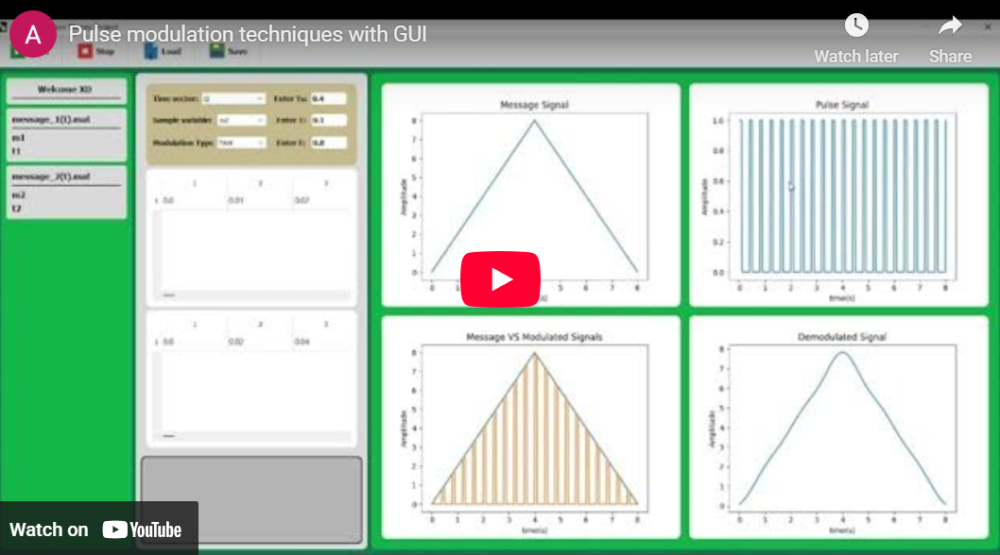

# Analog Pulse Modulation GUI 📡🔲

A comprehensive PyQt5-based GUI application for simulating analog pulse modulation techniques including PAM (Pulse Amplitude Modulation), Flat-Top PAM, PWM (Pulse Width Modulation), and PPM (Pulse Position Modulation) with complete modulation and demodulation analysis.

[](https://www.youtube.com/embed/EMaJe0p-LCI?si=w7WT1rVoD1aHonX0)

## 📋 Description

This project demonstrates analog pulse modulation techniques through an interactive graphical user interface. Users can load arbitrary message signals and apply different pulse modulation schemes, visualizing the modulation process, modulated signals, and demodulated outputs in real-time.

The application includes complete modulation/demodulation algorithms implemented from first principles, frequency domain analysis, and low-pass filtering for signal recovery.

<br>
<div align="center">
  <a href="https://codeload.github.com/TendoPain18/pulse-modulation-techniques-gui/legacy.zip/main">
    
  </a>
</div>

## 🎯 Project Objectives

1. **Implement PAM Modulation**: Natural sampling with pulse train
2. **Implement Flat-Top PAM**: Sample-and-hold modulation
3. **Implement PWM**: Pulse width varies with message amplitude
4. **Implement PPM**: Pulse position varies with message amplitude
5. **Demonstrate Demodulation**: Complete signal recovery process
6. **Interactive GUI**: User-friendly interface for parameter adjustment

## ✨ Features

### Four Modulation Techniques
- **PAM (Pulse Amplitude Modulation)**: Natural sampling
- **Flat-Top PAM**: Sample-and-hold with rectangular pulses
- **PWM (Pulse Width Modulation)**: Varying pulse width
- **PPM (Pulse Position Modulation)**: Varying pulse position

### GUI Features
- **File Loading**: Load `.mat` files containing message signals
- **Parameter Control**: Adjustable Ts, T, A parameters
- **Real-Time Visualization**: Four-plot display system
- **Multiple Test Cases**: Pre-configured test signals
- **Error Handling**: Input validation and error messages

### Signal Processing
- **Pulse Generation**: Rectangle, sawtooth, and triangle pulses
- **Low-Pass Filtering**: Butterworth filter for demodulation
- **Time-Domain Demodulation**: Sinc interpolation
- **Frequency Analysis**: FFT-based spectrum analysis

## 🔬 Theoretical Background

### PAM (Pulse Amplitude Modulation)

**Modulation Process:**
```
s(t) = m(t) × p(t)
```

Where:
- `m(t)` = Message signal
- `p(t)` = Pulse train with period Ts and width T
- `s(t)` = Modulated signal

**Demodulation:**
```
m_recovered(t) = LPF[s(t)]
```

Low-pass filter with cutoff frequency: `fc > B` and `fc < (fs - B)`

**PAM Message Signal:**

<div>
  
  
</div>

**PAM Pulse Train:**

<div>
  
  
</div>

**PAM Modulated Signal:**

<div>
  
  
</div>

**PAM Demodulated Signal:**

<div>
  
  
</div>

---

### Flat-Top PAM

**Modulation Process:**
```
s(t) = m(nTs) × p(t)    for nTs ≤ t < (n+1)Ts
```

The amplitude is held constant at the sampled value throughout the pulse duration.

**Key Difference from Natural PAM:**
- Natural PAM: Pulse amplitude follows message signal continuously
- Flat-Top PAM: Pulse amplitude is constant at sample value

**Flat-Top PAM Message Signal:**

<div>
  
  
</div>

**Flat-Top PAM Pulse Train:**

<div>
  
  
</div>

**Flat-Top PAM Modulated Signal:**

<div>
  
  
</div>

**Flat-Top PAM Demodulated Signal:**

<div>
  
  
</div>

---

### PWM (Pulse Width Modulation)

**Modulation Process:**
1. Generate triangular/sawtooth carrier wave
2. Compare message signal with carrier
3. Output pulse width proportional to message amplitude

**Modulation Equation:**
```
Width(t) ∝ m(t)
s(t) = 1 if m(t) > carrier(t), else 0
```

**Demodulation:**
1. Convert PWM to PAM (integrate over pulse period)
2. Apply low-pass filter

**PWM Message Signal:**

<div>
  
  
</div>

**PWM Triangular Carrier Signal:**

<div>
  
  
</div>

**PWM Modulated Signal:**

<div>
  
  
</div>

**PWM Demodulated Signal:**

<div>
  
  
</div>

---

### PPM (Pulse Position Modulation)

**Modulation Process:**
1. Generate PWM signal
2. Extract trailing edge of each pulse
3. Generate fixed-width pulse at trailing edge position

**Position Shift:**
```
Position(t) ∝ m(t)
```

**Demodulation:**
1. Convert PPM back to PWM using SR flip-flop
2. Convert PWM to PAM
3. Apply low-pass filter

**PPM Message Signal:**

<div>
  
  
</div>

**PPM Sawtooth Carrier Signal:**

<div>
  
  
</div>

**PPM Modulated Signal (with Reference Pulses):**

<div>
  
  
</div>

**PPM Demodulated Signal:**

<div>
  
  
</div>

---

## 📊 Test Cases

### Test Case 1

**Message Signal:**
```
m(t) = 3cos(4πt)
where t = 0:0.001:1
```

**Parameters:**

| Modulation Type | Ts | T | A |
|----------------|-------|---------|-----|
| PAM | 1/8 | 0.25×Ts | - |
| Flat-Top PAM | 1/8 | 0.25×Ts | - |
| PWM | 1/8 | - | 2 |
| PPM | 1/8 | 0.1×Ts | 2 |

### Test Case 2

**Message Signal:**
```
m(t) = {
    2t,        0 ≤ t ≤ 4
    16 - 2t,   4 ≤ t ≤ 8
}
where t = 0:0.01:8
```

**Parameters:**

| Modulation Type | Ts | T | A |
|----------------|-----|------|-----|
| PAM | 0.4 | 0.1 | - |
| Flat-Top PAM | 0.4 | 0.4 | - |
| PWM | 0.4 | - | 2 |
| PPM | 0.4 | 0.05 | 2 |

## 🚀 Getting Started

### Prerequisites

**Python Requirements:**
```
Python 3.7+
PyQt5 5.15.4
scipy 1.7.2
numpy 1.21.0
matplotlib 3.4.3
```

**MATLAB (Optional):**
- For generating custom message signals
- MATLAB R2018a or later

### Installation

1. **Clone the repository**
```bash
git clone https://github.com/yourusername/analog-pulse-modulation-gui.git
cd analog-pulse-modulation-gui
```

2. **Install Python dependencies**
```bash
cd python_gui_code
pip install -r requirements.txt
```

3. **Run the application**
```bash
python main.py
```

## 📖 Usage Guide

### Starting the Application

1. **Launch Window**: Run `main.py`
2. **Wait for Initialization**: Progress bar indicates loading
3. **Main Window Opens**: GUI interface appears

### Loading Message Signals

1. Click **Load** button in toolbar
2. Select `.mat` file containing message signal
3. File appears in left panel with variables
4. Variables automatically populate dropdown menus

### Configuring Modulation

**Select Parameters:**
- **Time Vector**: Choose from loaded variables
- **Message Signal**: Choose from loaded variables
- **Modulation Type**: Select PAM, Flat-Top PAM, PWM, or PPM

**Enter Values:**
- **Ts (Sampling Period)**: Time between samples
- **T (Pulse Width)**: Duration of pulse (for PAM/Flat-Top PAM/PPM)
- **A (Amplitude/Frequency)**: Carrier amplitude (PWM) or filter cutoff (PPM)

### Running Modulation

1. Configure all parameters
2. Click **Start** button
3. View results in four plots:
   - **Plot 1**: Original message signal
   - **Plot 2**: Pulse/carrier signal
   - **Plot 3**: Modulated signal
   - **Plot 4**: Demodulated signal

### Generating Test Signals (MATLAB)
```matlab
% Message Signal 1
t1 = 0:0.001:1;
m1 = 3 * cos(4 * pi * t1);
save('message_1(t).mat', 't1', 'm1');

% Message Signal 2
t2 = 0:0.01:8;
m2 = zeros(size(t2));
for i = 1:length(t2)
    if t2(i) <= 4
        m2(i) = 2*t2(i);
    else
        m2(i) = 16-2*t2(i);
    end
end
save('message_2(t).mat', 't2', 'm2');
```

## 🔧 Implementation Details

### Low-Pass Filter Design

**Butterworth Filter:**
```python
def butter_lowpass_filter(data, cutoff, fs):
    # Adaptive order calculation
    b = fs / 4
    c = 150
    a = (16 * c) / fs ** 2
    order = ceil(-a * ((cutoff - b) ** 2) + c)
    
    # Create and apply filter
    b, a = butter(order, cutoff, fs=fs)
    output = lfilter(b, a, data)
    return output
```

### Time-Domain Demodulation

**Sinc Interpolation:**
```python
def time_domain_demodulator(signal, time, Ts, B):
    demod = zeros_like(signal)
    shift = 0
    
    for sample in signal (at Ts intervals):
        sinc_function = 2 * B * Ts * sample * sinc(2 * B * (t - shift))
        demod += sinc_function
        shift += Ts
    
    return demod
```

### PWM Generation

**Comparator Method:**
```python
def pwm_modulation(message, Ts, A):
    # Generate triangular carrier
    carrier = triangle_wave(Ts, min-band, max+band)
    
    # Compare
    pwm = (message > carrier) ? 1 : 0
    
    return pwm
```

### PPM Generation

**Edge Detection:**
```python
def ppm_modulation(message, Ts, T):
    # Generate PWM
    pwm = pwm_modulation(message, Ts)
    
    # Detect trailing edges
    edges = detect_falling_edges(pwm)
    
    # Generate fixed-width pulses at edges
    ppm = generate_pulses_at(edges, width=T)
    
    return ppm
```

## 🎓 Learning Outcomes

This project demonstrates:

1. **Pulse Modulation**: PAM, Flat-Top PAM, PWM, PPM techniques
2. **Sampling Theory**: Nyquist sampling theorem application
3. **Signal Processing**: Filtering, interpolation, spectrum analysis
4. **GUI Development**: PyQt5 interface design
5. **Real-Time Visualization**: Matplotlib integration
6. **Demodulation**: Signal recovery techniques
7. **Python/MATLAB Integration**: `.mat` file handling

## 📈 Key Concepts

### Sampling Theorem

For proper signal recovery:
```
fs ≥ 2 × fmax
```

Where:
- `fs` = Sampling frequency (1/Ts)
- `fmax` = Maximum frequency in message signal

### Bandwidth Comparison

| Modulation | Bandwidth Required |
|------------|-------------------|
| PAM | B = fmax |
| Flat-Top PAM | B ≈ fmax |
| PWM | B >> fmax |
| PPM | B >> fmax |

### Noise Immunity

**Ranking (Best to Worst):**
1. PPM (Position encoding)
2. PWM (Width encoding)
3. PAM (Amplitude encoding)
4. Flat-Top PAM (Amplitude encoding)

## 🤝 Contributing

Contributions are welcome! Feel free to:

- Add new modulation techniques (PCM, Delta Modulation)
- Improve demodulation algorithms
- Enhance GUI features
- Add more test cases
- Optimize performance
- Add noise analysis

## 📄 License

This project is licensed under the MIT License - see the [LICENSE](LICENSE) file for details.

## 🙏 Acknowledgments

- Course: CIE 337 - Communications Theory and Systems
- Department: Communications and Information Engineering
- PyQt5 for GUI framework
- MATLAB for signal generation
- Communications systems fundamentals

<br>
<div align="center">
  <a href="https://codeload.github.com/TendoPain18/pulse-modulation-techniques-gui/legacy.zip/main">
    
  </a>
</div>

## <!-- CONTACT -->
<div id="toc" align="center">
  <ul style="list-style: none">
    <summary>
      <h2 align="center">
        🚀 CONTACT ME 🚀
      </h2>
    </summary>
  </ul>
</div>

<table align="center" style="width: 100%; max-width: 600px;">
  <tr>
    <td style="width: 20%; text-align: center;">
      <a href="https://www.linkedin.com/in/amr-ashraf-86457134a/" target="_blank">
        
      </a>
    </td>
    <td style="width: 20%; text-align: center;">
      <a href="https://github.com/TendoPain18" target="_blank">
        
      </a>
    </td>
    <td style="width: 20%; text-align: center;">
      <a href="mailto:amrgadalla01@gmail.com">
        
      </a>
    </td>
    <td style="width: 20%; text-align: center;">
      <a href="https://www.facebook.com/amr.ashraf.7311/" target="_blank">
        
      </a>
    </td>
    <td style="width: 20%; text-align: center;">
      <a href="https://wa.me/201019702121" target="_blank">
        
      </a>
    </td>
  </tr>
</table>

<!-- END CONTACT -->

## **Master analog pulse modulation with interactive visualization! 📡✨**
